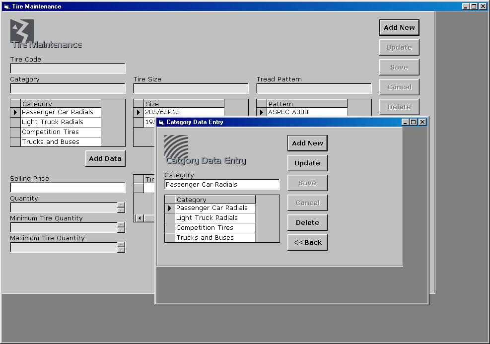



## A Tire Inventory System

### Description

This inventory system for tires include: Administrator Password, User Account, Tire Maintenance with Category, Tire Size and Tread Pattern Data Entry and Data Report, Customer Maintenance with Data Report, Sales Invoice with Receipt, Printable Monthly Earnings and Order Slip Form with Supplier Data Entry. Made with ADO. 100% working and bug free. *Administrator password is "DBMS".
 
### More Info
 

             |
---                |---
**Submitted On**   |1999-11-26 04:31:16
**By**             |[Enrico Lorenzo](https://github.com/Planet-Source-Code/PSCIndex/blob/master/ByAuthor/enrico-lorenzo.md)
**Level**          |Beginner
**User Rating**    |4.6 (115 globes from 25 users)
**Compatibility**  |VB 6\.0
**Category**       |[Databases/ Data Access/ DAO/ ADO](https://github.com/Planet-Source-Code/PSCIndex/blob/master/ByCategory/databases-data-access-dao-ado__1-6.md)
**World**          |[Visual Basic](https://github.com/Planet-Source-Code/PSCIndex/blob/master/ByWorld/visual-basic.md)
**Archive File**   |[\_Tire\_Inve184818242005\.zip](https://github.com/Planet-Source-Code/enrico-lorenzo-a-tire-inventory-system__1-58665/archive/master.zip)

